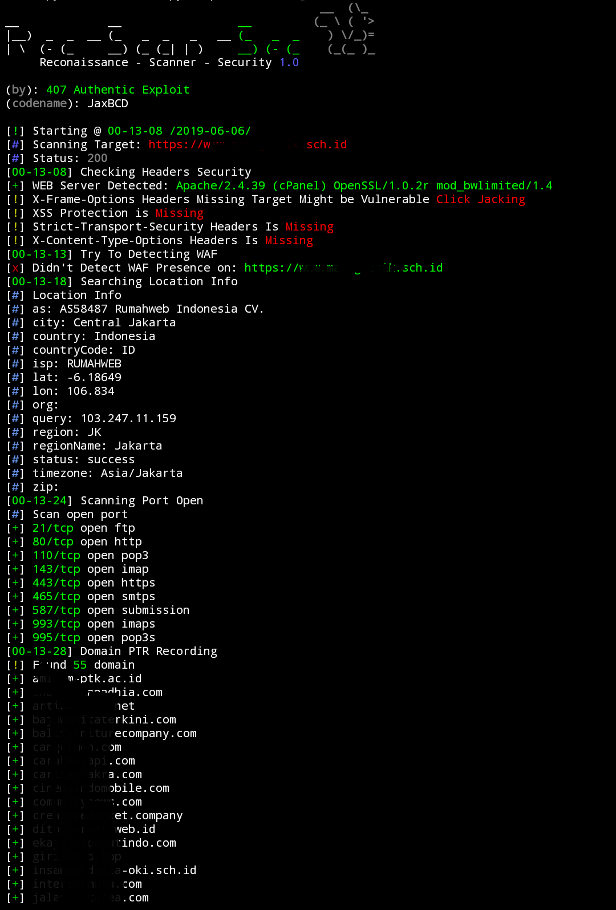

<h1 align="center">
    <br>
    <a href="https://github.com/jaxBCD/RecScanSec">
    
    </a>
    <br>    
</h1>

<h4 align="center">Reconnaisance Scanner Security.</h4>
<p align="center">
   <a href="https://github.com/jaxBCD/RecScanSec">
      
   </a>
   
   <a href="https://www.python.org">
      
   </a>
</p>

### About
 RecScanSec made for reconnaisance Scanner and information gathering with an emphasis on simplicity.<br> 
 It will do everything from.</br>

### Features
 * Information Security Headers
 * WAF Analyzer
 * Information Disclosure
 * Banner Grabbing
 * Url Crawl
 * HTML Form Detector
 * Port Scanner
 * Get SSL Information
 * Subdomain Enumeration
 * Host Mapper
 * Url Fuzzing & sensitive dir
 - all results scanned will be saved in the output directory

#### Requirements
 * asyncio
 * click
 * requests
 * colorlog
 * bs4
 * tldextract

#### Usage & Installation
 ```
 $ apt-get install python3 nmap
 $ pip3 install -r requirements.txt
 $ python3 RecScanSec.py http://target.co.li
 
Usage: RecScanSec.py [OPTIONS] TARGET

Options:
  --version          Show the version and exit.
  --timeout INTEGER  Seconds to wait before timeout connections
  --proxy TEXT       if Use a proxy ex: 0.0.0.0:8888 if with auth
                     0.0.0.0:8888@user:password
  --cookies TEXT     if use cookie comma separated cookies to add the
                     requestex: PHPSESS:123,kontol:True
  --no-url-fuzzing   do not fuzz url
  --update           Check For Update
  --help             Show this message and exit.
     
 ```
#### Screenshot
<h1 align="center">
    <br>
    <a href="https://github.com/jaxBCD/RecScanSec">
    
    </a>
    </br>
</h1>    

##### Info
 Support For Python Version: ```3.7```<br>
 RecScanSec Version: ```1.0```<br>
 By: ```407 Authentic Exploit ```<br>
 Codename: ```JaxBCD```<br> 